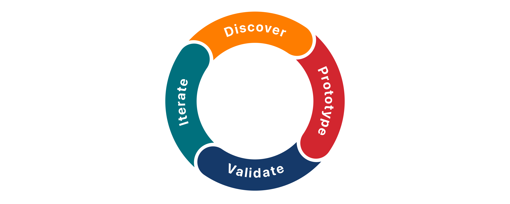
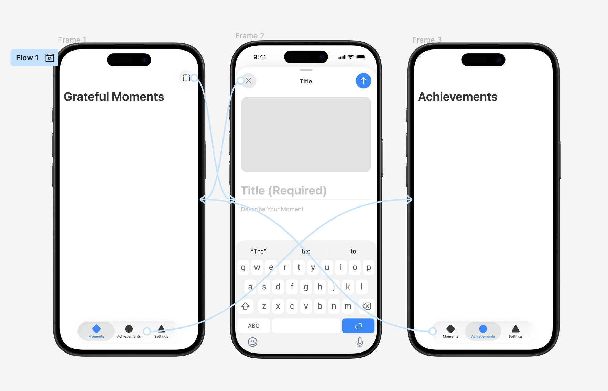
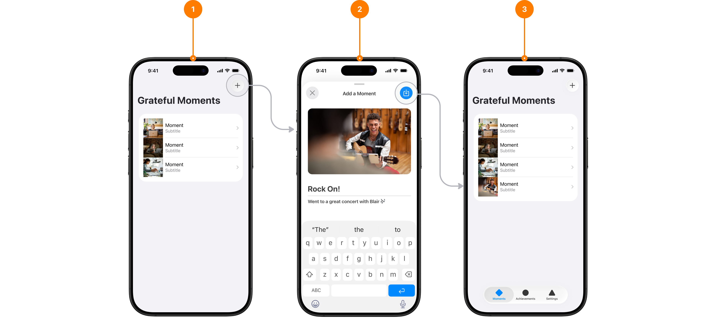
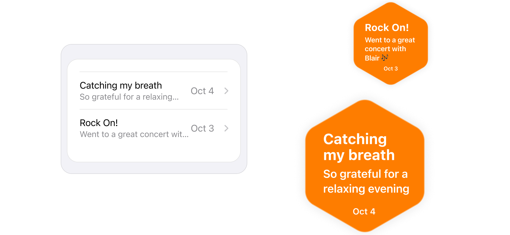

# Welcome to app design 
[link](https://developer.apple.com/tutorials/develop-in-swift/welcome-to-app-design)

## What you’ll learn
* Define app goals by focusing on people's needs
* Prioritize features (clear focus)
* Create a user journey
* Create interactive prototypes
* Organize content
* Conduct user testing
* Determine iteration based on insights from testing

[Design Resources](https://developer.apple.com/design/resources/)

--- 

# Explore the app design cycle

[**Discovery**](#discovery---ask-questions): talk to people to understand the problem. Ideas based on user feedback. Organize features into simple sketches.  
[**Prototypes**](#prototypes---build-an-interactive-prototype): simple, testable versions. Often with no code. Interactive screens (more complex than sketches, less than full app). Used to explore different approaches.  
[**Validation**](#testing-and-validation---test-your-app): test with users to validate work and check if solves the problem. Observe interaction with the product, interpret the results to determine features that need rework.  
**Iteration**: Take insights and refine ideas and prototypes.  

---

# Discovery - Ask questions
Talk to people. Look for patterns in the challenges they face and identify opportunities. 
(Tutorial uses an example app for people to capture moments of gratitude. Design principles still apply to different apps).

## Section 1 - Talk to people
How can you help people reach a goal? (Design question). What goals they have. What helps, what hinders them.  
Refine initial idea by talking to people. Emotions, challenges, unmet needs help shape app direction.

#### Step 1
Talk to someone you know how they keep up with habits. Their process. Take notes on what habit they mention, tool they use, if any, how often. Joys and struggles.  
(For a different app ask open-ended questions that fit your theme).    

#### Step 2
Write 2/3 insights. Try to identify unmet needs, friction points.   
Example:  
“She records her workouts in Notes. She often forgets unless she already has the app open.”  
“He uses alarms so he doesn’t forget. He wants it to feel more fun, not like a to-do.”

## Section 2 - Look for patterns
Gather observations related to how you want to help. Look for patterns in responses.  
Emotional points are powerful motivators you can tap into making the app useful and compelling.  

#### Step 1 
Talk to more people who might use the app you’re designing. Ask open-ended questions about their needs, goals and experiences. Not just what they say, how they say it.  
"What would you like this activity to feel like?"  
"Tell me about other tools you used in the past to help."  

#### Step 2
Highlight ideas and themes that repeat in the notes. Group similar ideas, emotions and problems. What do they care about? Where they get stuck?

#### Step 3
Write clear insights from patterns. Use to spot opportunities to improve the app. Start with just 2/3.  
Collect more feedback to find more patterns.  

## Section 3 - Do it yourself
Reflect on your own experience.

#### Step 1
Pick a habit your app might support. Try it. What feels easy or enjoyable? What feels harder or frustrating? 

#### Step 2 
How did that feel? Easy or awkward? Anything felt motivating or frustrating? What suprised you? What got in your way? 

#### Step 3
What would make me want to do this again? How the app can boost motivation? How can it ease frustration? What kind of tone or guidance might help?  
This helps the tool feel warm and empathetic.  

Start with people and their goals to guide your design choices.

---

# Discovery - Organize your features
Identify essential features to define its structure. Decide how to organize them and plan how people navigate through the app.  

An app structure guides how people find their way, highlights important features, shapes experience from first interaction.

## Section 1 - Define what is essential to your app
The list of features grows quickly. Focus on what is critical. Focus on the app's purpose to decide what it truly needs.  
When, where and how people will use it? What will help? What will get in the way? Focusing on essentials makes the app easier to navigate and more empowering.

#### Step 1
Write down every feature.

#### Step 2
Choose essential features and set the rest aside.  
Example:  
For an app that encourages a habit of being grateful one feature that is critical might be adding an entry — details about a time the user felt grateful.

#### Step 3
For each essential feature, write ideas for how to bring it into the app.

#### Step 4
Identify steps for each feature. Set aside what feels distracting, repetitive or unclear.

## Section 2 - Group related features
People want to move through the app with confidence that features would be in logical places.  
Group related features together. Think in terms of spaces or sections. 

#### Step 1
List essential features (physical or digital notes). Include actions or elements of each on its note.  
(You should be able to move them around).

#### Step 2 
Move notes until related features feel naturally grouped together.  
This sets the stage to create screens and navigation.  
Example:  
Viewing past entries and recording new entries form a group, because they’re both focused on the user’s entries. User settings and in-app achievements wouldn’t be part of that group.

#### Step 3
Label each group with a simple, clear name.

## Section 3 - Sketch your screens
Turn notes to sketches to map both screens and flow between them. Decide key screens and how people will navigate using iOS components (tab bar, toolbar).

#### Step 1
Sketch screens based on essential features. Draw boxes for images or media, gray bars for text. Size based on importance. Leave space to note the intention for each screen to help with the flow.  
Many of the essential features will have their own screens. When grouping features keep screens focused (easy to understand).

#### Step 2
Review sketches, decide which screens deserve a tab. Tabs represent main app destinations — what users will visit more often. Add tab bars to the sketched screens.  
Would someone access this area frequently? If so it likely deserves a tab.  
Note:  
Tab bar is the best way to reach main sections. Always visible and easy to access. Keep 3 to 5 at most. It is for navigation, not actions.  

#### Step 3
For each screen, think about the main action people will take. Besides navigating to another tab, decide whether the screen should have a toolbar (1/2 essential actions). Add toolbars to sketched screens. Include a clear title that names current screen and actions people are most likely to use in that context.  
Note:
Toolbar sits at the top. Orients people with clear title. Provides important actions. Includes: back/forward navigation (not on iOS 26), search (not on iOS 26), add/cancel buttons (not on iOS 26), menus of commands people use frequently.

#### Step 4
Trace a journey through the actions. Do you know where you are at each step? Is the next step obvious?  
(It should aim to feel predictable without explanation. If not repeat sketch process).

## Section 4 - Understand structure and navigation
[Human Interface Guidelines](https://developer.apple.com/design/human-interface-guidelines) - Best practices to design great experience. Emphasize hierarchy, harmony, and consistency.  
When users instantly know where they are, what they can do, where they can go next, the app feels effortless. This makes users come back.   
Clear structure. Features grouped intuitively in purposeful screens. Navigation anchored by the right use of tab bar and toolbar.  

The tab bar provides navigation to your app’s main screens. Keep your tab bar focused, and remember that it’s only for navigation, not actions.  

---  

# Discovery - Wrap-up: Discovery

## Reflect on the design principles
Effective designs start with clarity. This chapter is about refining an app's purpose. Who is it for and organizing navigation so it feels intuitive.  
Test assumptions by talking to people. What they say, how they say it. Spotting patterns. Motives or overwhelming factors.  
Defining an essential feature list. Grouping screens by function. Simplifying user experience.  
This creates a strong foundation for the design.  

### Topics and skills covered 
* Identifying opportunities and defining a clear purpose
* Talking to people and identifying behavior patterns
* Refining an idea focusing on essential features
* Organizing features into logical screen groups
* Structuring the app using tab bar and toolbars
* Creating screen Sketches 

## Continue practicing

### Extend your design
1. Show sketches to someone and ask what they expect the screen to do. Attention to where your intentions need clarification. 
2. Revisit navigation structure. Anything redundant, unnecessary? Try combining and removing items, see how it changes overall experience, does it still work?

### Challenge yourself 
Add more ideas. Sketch additional screens, alternate versions of the main screen or flows for onboarding, confirmation, error states. Consider edge cases. 

### Learn more
Explore [Designing for iOS](https://developer.apple.com/design/human-interface-guidelines/designing-for-ios/) (From Human Interface Guidelines) to deepen understanding of navigation, layout, and structure.  

--- 

# Prototypes - Build an interactive prototype
Build a prototype with navigation.

## Section 1 - Create higher-fidelity screen prototypes
Use SF Pro font and iOS resources to build prototypes that look like iOS screens.

#### Step 1
Download [design resources](https://developer.apple.com/design/resources/#ios-apps).

#### Step 2
Open and explore resources. Look for what matches the elements in your screen sketches.

#### Step 3
Download [SF Pro font](https://developer.apple.com/design/resources/#fonts)

#### Step 4 
Re-create sketches.  
Choose components that closely match your sketches.

## Section 2 - Connect the flow
Link screens to test how people move through the app.

#### Step 1
Connect screens with clickable links.  
You might find some rework is needed. Iteration is essential.

#### Step 2
Click through the path to complete essential tasks as a first-time visitor. Notice the flow. What feels natural, what feels unclear.

## Section 3 - Add just enough interaction
Add visual effects to mimic key OS behaviors.  
It doesn't need every gesture/animation. Focus on the essentials: clickable buttons, screen transitions, app navigation. 

#### Step 1
Choose one key transition in your flow (such as moving from the main screen to a modal for adding content).  
[Modals](https://developer.apple.com/design/human-interface-guidelines/modality) present content that requires action from the person. Common tasks: confirming an action, and adding content.  

#### Step 2
Use a simple animation in the design tool, like a slide or fade, to signal change.  
(Modals slide up from the bottom of the screen).

#### Step 3
Preview interaction and verify if it improves orientation or creates confusion. Repeat for key transitions.

## Section 4 - Test it
Work through essential tasks on the app individually. Notice moments of hesitation. Small pauses may signal design issues.   
Ask yourself:  
* Do I know where I am? 
* Do I know what I can do?
* Do I know where to go next? 

Refine design and prototype until ready to begin testing it with other people. 

Animations and transitions can help people stay oriented. They can also be distracting. By focusing on only the essentials you can get better testing experience without extra work.

# Prototypes - Wrap-up: Prototypes
Prototypes move from abstract ideas to something concrete people can test.  

## Use high-fidelity resources
Help create a prototype that feels like the finished app.

### Topics and skills covered
* Exploring standard components in the iOS framework
* Using SF Pro font
* Connecting a feature flow by linking sketches
* Walking through the flow created to detect points of friction
* Adding essential transitions

## Continue practicing

### Extend your design
1. Share prototype with others.
2. Test on device. Notice difference between mouse and finger. Are elements large enough? 

### Challenge yourself
Use [SF Symbols](https://developer.apple.com/design/resources/#tools). Check symbols. Use them to add clarity.

### Learn more
* Read [Discussion of modality for iOS](https://developer.apple.com/design/human-interface-guidelines/modality) in HIG.

---

# Testing and validation - Test your app
Ask people to complete a task in the prototype. Plan testing session. Observe interaction. Ask questions. Check assumptions.

## Focus your test
Start with the most essential functionality, then identify the necessary steps to use that feature.

Example:  
In a gratitude app, the essential feature is recording a moment of gratitude. Steps:
1. Tap the + button.
2. Add short text (title).
3. Optionally include notes or a photo.
4. Save the entry.
5. See the new entry in the list.

Narrow the scope of testing to a single essential feature to focus on what really matters. 

## Identify the steps to use the feature
Write everything someone needs to do to use the selected feature.
* Where do they start? 
* What specific tasks/actions do they need to take? What happens in the app at each step?
* What should happen at the end?

Example:   
To record a moment of gratitude, the user starts on the main screen (1). Tap + button in toolbar, opening a modal with entry fields (2). After entering their information, then they tap Save in the toolbar and return to main screen, where new entry appears in the list (3). 

A detailed task list makes it easier to spot any errors or unclear areas. 

## Plan test sessions
The structure of test sessions is just as important as defining what to test.
* **Where will the test take place?** In person or virtually, choose what works best for everyone.
* **How long will it take?** Short. 10 min or less. Makes recruiting easier and help testers feel at ease. 
* **How will you capture what happens?** Record people's interactions with your prototype to review details later. With permission, use phone or screen recorder. 
* **Who will take notes?** Have a third person take notes to focus on running the test.

Sessions should run smoothly and consistently from one tester to the next. Use feedback to refine design. 

## Write a test script
To keep test sessions consistent use a script. Write prompts on what to say before, during, and after a task.  
Before showing the prototype and explaining the task, tell there is no wrong answers and that their feedback directly shapes the app.  
Plan how to introduce the app idea, prototype, and task. Don't tell how. Ask open-ended questions, such as "What do you think this will do?" or "How would you accomplish this task?"  

Example:  
To test adding an entry, show the main screen with the + button and ask "Looking at this screen, what do you think this plus button does?" After recording their answer, say, "Please try to add an entry to the list on this screen."

Observe carefully, without giving additional instructions. Do they hesitate, or complete the task smoothly?  
After they complete the task, ask questions such as "How did you feel about that process?" and "Did you find anything confusing?"  
Use the script to plan a mix of doing and reflecting, getting insight into both behavior and emotion.  

## Learn from friction
Expect people won't complete the task smoothly or confidently. Moments of hesitation or wrong taps often provide the most valuable feedback. Avoid jumping in. Keep asking open-ended questions, such as "What do you expect will happen if you tap that?"  

Example:  
If a modal uses a save icon, someone might add an entry and assume they can edit it to make changes. If the app doesn't support editing, it creates a confusion. In this case a checkmark icon may be a better choice. 

Frustrations and mistakes people make reveal design refinement points. Those insights become the compass for improvement. Clearer icons, flexible input, smoother flow, another change, testing helps you see how to refine your design.  

# Testing and validation - Validate your app 
Turn feedback into insights. Use insights to refine design. 

Organize raw feedback — observations, quotes, and recordings. Capture it in small notes. Sort and compare notes to decide what to do next. 

## Break your feedback into simple notes
In the review focus on where people struggled or their expectations didn't match design assumptions. Capture each issue on physical or digital note, one idea per note. 

Focus on what happened and what people said. 

## Form key insights
Look for patterns. Move notes and group similar themes.   
Notice details like a confusing button or required entry field that feels restrictive.  
People may be unsure whether new content actually saved. They might run into usability issues, keyboard covering content is common.  

Sort and group until clear patterns emerge. 

## Draw conclusions
For each pattern, ask, "Why did this happen?". Keep asking why to get to the root cause.  
Example:  
* People unsure whether content was added. Why?
* They couldn't see the new content onscreen right away. Why?

* Saving the data entry returns to data entry form, not main screen. 

Other examples: 
1. People associate the button icon with different action.  
2. People want entries with the fewest required steps.  
3. Saving the data entry field returns them to the data entry form, not to the main screen. 
4. Text input blocked by keyboard.

Address fixes later. Clearly define what's happening first. Insights not solutions. Understanding what works, what doesn't, and, most importantly, why.

## Organize conclusions by theme
Label root causes with broader categories.  
Example:  
1. Interface: Button icon associated with different action. 
2. Flow: People want to add entries with the least number of required steps.
3. Navigation: Saving the data entry field returns the to the data entry form, not to the main screen. 
4. Usability: The text input field is blocked by the keyboard. 

## Decide what to revisit 
Turn insights into solutions. Identify phases of the design cycle to revisit as you iterate and refine the app design. Plan to test again after changes to confirm refinements addressed the problems identified.  
Example:  
1. Replace save icon with checkmark icon. (Return to prototyping, then testing.)
2. Explore a "Quick Add" photo-only option. (Return to discovery, then testing.)
3. Add a success state after saving. (Return to prototyping, then testing.)
4. Adjust text input placement and screen scroll behavior. (Return to prototyping, then testing.)

Linking conclusions back to a design phase keeps iteration structured instead of reactive. 

# Testing and validation - Wrap up: Testing and validation
Identify key task to test, plan sessions, observe how people use prototype to spot friction. Analyse the results to find opportunities to improve app functions.

## Define your test to capture insights
Focus on sinle essetial task helps get the most from testing with people. Ask open-ended questions. Find signs of friction. Refine app design. 

### Topics and skills covered
* Defining testing goals by focusing on actions that matter most
* Creating a journey map to orient everyone involved in the test process
* Writing a test script to keep consistency in sessions and limit variables.
* Paying attention to friction in the flow.
* Noticing themes by grouping similar comments together.
* Finding root causes in patterns from testing comments. Organizing them into themes
* Making a plan to put findings into action. 

## Continue practicing

### Extend your design
1. If testing doesn't produce actionable insights, try again. Restructure our test to get the inut you need to improve. 
2. Testing takes many forms. Short, informal sessions can provide different insights than longer, structured ones. Compare approaches results. What can you learn from each?

### Challenge yourself
Consider your test setting. The environment can affect peoples behavior. Choose setting based on app and test needed.

### Learn more
Use welcoming language in app during testing. [Inclusive language and features for iOS](https://developer.apple.com/design/human-interface-guidelines/inclusion)

--- 

# Iteration - Iterate on your design
Refine design systematically. Anchor every change to esign principles and discovery findings. Prototype, test and validate experiences.

## About iteration
It means repeating phases of the design cycle as many times as you need. Incorporate user feedback and improve your app with every interation.  

## Create visual consistency with system tools
Consistent visual elements make an app feel polished.

### Fonts and symbols
SF Pro is the system font. Designed for legibility at various screen sizes. SF Symbols provide icons that reduce ambiguity.  

### Consider accessibility
[Dynamic Type](https://developer.apple.com/design/human-interface-guidelines/typography#Supporting-Dynamic-Type) lets people adjust text size to ensure redability and comfort.  
Built-in styles (title, body, caption...) automatically adapt to Dynamic Type and other accessibility settings. 

### Use colors that adapt
[Color](https://developer.apple.com/design/human-interface-guidelines/color) is important in accessibility. Use system colors to automatically adapt to light and dark modes.  
System colors also ensure text and other elements are legible across different environments.

## Use insights to refine your design
Apply insights from testing and validation. Reduce confusion, meet people's expectations, and reduce friction.  

## Incorporate custom elements with care
One goal of the example app (gratitude app) is to evoke the feeling of being on a journey. Good app design connects structure to feeling. The list entries mimics a path of stepping stones, so each entry feels like a step in a larger journey.  

  

This ties the app's emotional intent with the interface: helping people treat moments of gratitude as meaningful steps.  
It comes with tradeoffs: Using an hexagon you need to ensure text and container scale correctly with larger sizes using Dynamic Type. Built-in views handle that automatically.  
Iteration is about testing, refining, and testing again. Using system resources, like fonts colors, and icons, helps spend less time on reinventing patterns and more on emotional details that make the app resonate.  

# Iteration - Wrap-up: Iteration
App appearance and behavior is refined based on user testing information.  

## Moving forward and looking back
### Topics and skills covered
* Using feedback to iterate and improve design
* Creating visual consistency using a cohesive design system
* The importance of typography in creating an inclusive experience
* Applying colors that ensure contrast and legibility
* The rhythm of testing, refining, and testing again

## Continue pacticing
### Extend your design
1. With the new understanding of colors, explore a palette that changes the expression or character of the app.  
2. Continue to explore changes that might reduce friction discovered in testing.  

### Challenge yourself
Design for a different purpose. Design an app with similar theme but different purpose. Instead of a gratitude habit, focus on staying connected with friends or keeping your space tidy. Consider design changes in terms of features, hierarchy, and navigation to serve the new purpose.  
Explore custom symbols. Combine two or more SF Symbols to create a custom symbol.  

### Learn more
* Explore the [accessibility information](https://developer.apple.com/design/human-interface-guidelines/accessibility) in the HIG, especially the Vision section about text sizes and color. 