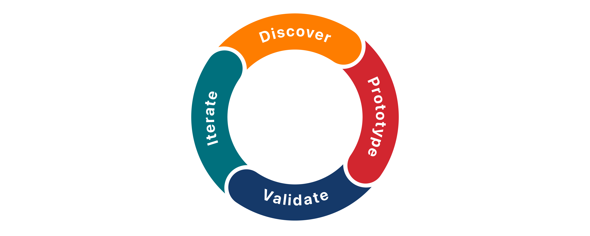

# Welcome to app design 

## What you’ll learn
* Define app goals by focusing on people's needs
* Prioritize features (clear focus)
* Create a user journey
* Create interactive prototypes
* Organize content
* Conduct user testing
* Determine iteration based on insights from testing

[Design Resources](https://developer.apple.com/design/resources/)

--- 

# Explore the app design cycle

Discovery: talk to people to understand the problem. Ideas based on user feedback. Organize features into simple sketches. 
Prototypes: simple, testable versions. Often with no code. Interactive screens (more complex than sketches, less than full app). Used to explore different approaches. 
Validation: test with users to validate work and check if solves the problem. Observe interaction with the product, interpret the results to determine features that need rework. 
Iteration: Take insights and refine ideas and prototypes. 

---

# Discovery - Ask questions
Talk to people. Look for patterns in the challenges and identify opportunities. 
(Tutorial uses an example app for people to capture moments of gratitude. Design principles still apply to different apps.)